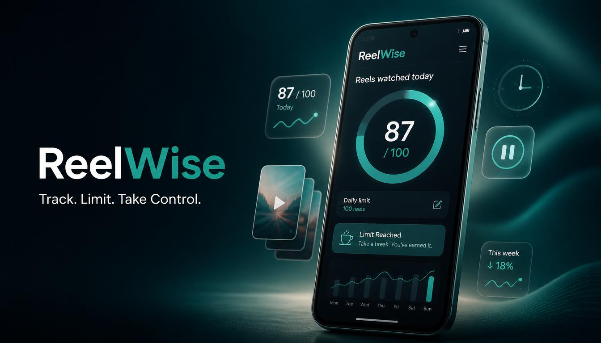
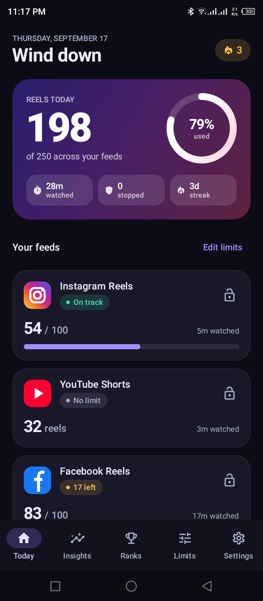
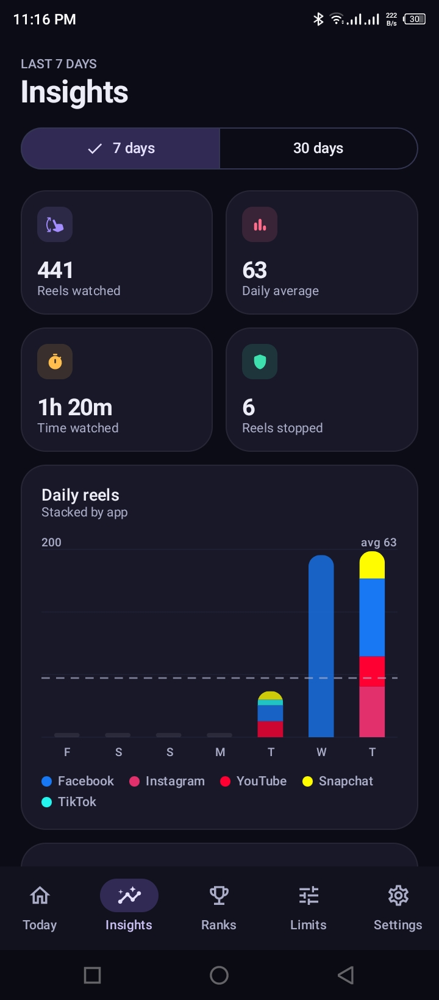
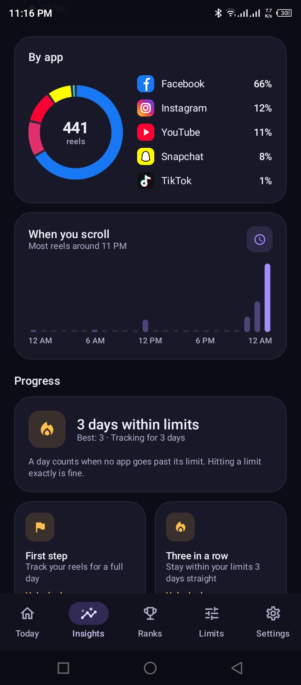
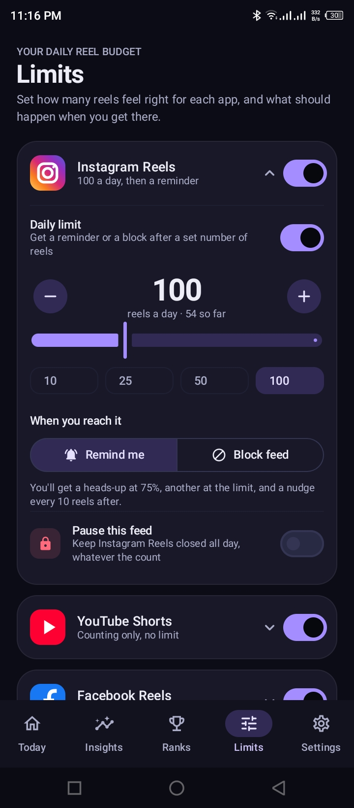
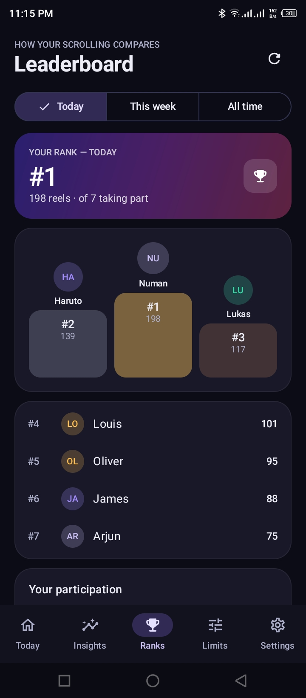

# 📱 ReelWise: Reels Counter

### Track. Limit. Take Control.

**ReelWise** is an Android digital-wellbeing app designed to help you understand and manage your short-form video scrolling habits.

It automatically tracks supported **Instagram Reels, Facebook Reels, and YouTube Shorts**, lets you set daily scrolling limits, provides alerts or blocking when limits are reached, and turns your activity into useful statistics, goals, streaks, challenges, and rankings.

> **ReelWise is built to make short-form scrolling more intentional — one reel at a time.**

<br>

<p align="center">
  <a href="YOUR_PLAY_STORE_URL">
    
  </a>
</p>

<p align="center">
  
</p>

---

## ✨ About ReelWise

Short-form videos are designed to keep you scrolling.

ReelWise takes a different approach to digital wellbeing by focusing not only on **how much time you spend**, but also on **how many Reels and Shorts you actually scroll through**.

With ReelWise, you can:

* 📊 Track your Reels and Shorts
* 🎯 Set daily scrolling limits
* 🔔 Receive alerts when your limit is reached
* 🛑 Block further short-form scrolling after reaching your limit
* 📈 Analyze your scrolling statistics
* 📅 Review your activity history
* 📱 See platform-specific activity
* 🏆 Maintain streaks and complete challenges
* 🎯 Set and track personal goals
* 🌎 Explore aggregate leaderboard rankings
* 🔐 Use optional account and cloud features

The goal is simple:

> **Know your scrolling. Set your limits. Take control.**

---

# 🚀 Key Features

## 📊 Reel & Shorts Counter

ReelWise automatically detects supported short-form video scrolling activity and keeps track of your daily count.

Currently supported platforms include:

| Platform     | Supported Content |
| ------------ | ----------------- |
| 📸 Instagram | Reels             |
| 🔵 Facebook  | Reels             |
| ▶️ YouTube   | Shorts            |

Counting behavior may depend on the current version of the supported third-party application and Android.

---

## 🎯 Daily Scrolling Limits

Set your own daily Reel/Short limit.

For example:

> **Daily Limit: 100 Reels**

ReelWise helps you monitor your progress throughout the day so you can stay aware of how much short-form content you are consuming.

---

## 🔔 Limit Alerts

Choose an awareness-focused experience.

When you reach your configured daily limit, ReelWise can notify you so you know that your target has been reached.

This makes it easier to pause and decide whether you actually want to continue scrolling.

---

## 🛑 Scrolling Limit Blocking

For users who want stronger control, ReelWise provides a blocking mode.

When the configured daily limit is reached, supported short-form scrolling can be blocked according to the app's configured behavior.

This gives you two different approaches:

**Alert Mode**

> Reach your limit → Get notified → Decide what to do

**Block Mode**

> Reach your limit → Further supported scrolling is blocked

---

# 📈 Statistics & Analytics

ReelWise transforms your scrolling activity into understandable statistics.

You can use your data to understand patterns such as:

* Daily Reel/Short count
* Scrolling trends
* Platform-specific activity
* Historical activity
* Goal progress
* Limit progress
* Long-term changes in your scrolling behavior

Instead of guessing how much you scroll, you can actually see the numbers.

---

# 📅 History

Review your previous scrolling activity and understand how your usage changes over time.

Historical data can help you identify:

* High-scrolling days
* Progress toward your limits
* Changes in daily behavior
* Platform-specific patterns
* Consistency over time

---

# 🏆 Goals, Challenges & Streaks

ReelWise adds a motivational layer to digital wellbeing.

### 🎯 Goals

Create personal targets and monitor your progress.

### 🔥 Streaks

Build consistency by maintaining your desired scrolling habits over multiple days.

### 🏅 Challenges

Take part in challenges designed around your scrolling goals and progress.

The idea isn't simply to count numbers — it's to turn those numbers into actionable habits.

---

# 🌎 Leaderboards & Rankings

ReelWise can provide aggregate ranking features where available.

Depending on the enabled features, users may be able to explore rankings across supported categories such as:

* 🌍 Global rankings
* 🇧🇩 Country-based rankings
* 📱 Platform-based rankings
* 📈 Rank history

Leaderboard functionality uses aggregate statistics and does not require ReelWise to access your social-media account credentials.

---

# 🔐 Privacy & Data

Privacy and data minimization are important parts of ReelWise.

ReelWise uses Android's **AccessibilityService** to recognize supported scrolling activity required for its counting and control features.

The AccessibilityService is used for the app's core functionality and is not intended to collect unrelated content from the applications you use.

ReelWise does **not** require your:

* Instagram password
* Facebook password
* YouTube password

The counting system is not intended to upload or collect:

* Screenshots
* Screen recordings
* Video files
* Audio recordings
* Captions
* Comments
* Direct messages
* Passwords
* General third-party app content

Optional account-related functionality may use **Firebase Authentication** and cloud services for features such as synchronization and aggregate statistics.

For advertising, ReelWise uses **Google Mobile Ads (AdMob)**.

For complete details, please refer to the app's Privacy Policy.

---

# 🧩 How ReelWise Works

At a high level, ReelWise works through the following flow:

```text
Supported Social App
        │
        ▼
Android AccessibilityService
        │
        ▼
Detect Supported Short-Form Content
        │
        ▼
Count Scrolling Activity
        │
        ├──────────────► Daily Limit
        │                    │
        │                    ├── Alert
        │                    │
        │                    └── Block
        │
        ▼
Local Activity Data
        │
        ▼
Statistics & History
        │
        ├── Goals
        ├── Challenges
        ├── Streaks
        └── Rankings
```

---

# 📱 App Screenshots

## Home Dashboard

<p align="center">
  
</p>

The home dashboard provides a quick overview of your current scrolling activity, daily progress, and important limits.

---

## 📊 Statistics

<p align="center">
  
</p>

Explore your scrolling activity through statistics and historical data.

---

## 📱 Platform Statistics

<p align="center">
  
</p>

Understand how your scrolling activity is distributed across supported platforms.

---

## 🎯 Daily Limits

<p align="center">
  
</p>

Configure your preferred daily Reel/Short limit and choose how ReelWise should respond when the limit is reached.

---

## 🏆 Goals & Challenges

<p align="center">
  
</p>

Set goals, complete challenges, and build consistent habits.

---

## 🔥 Streaks

<p align="center">
  
</p>

Track your consistency and maintain your progress through streaks.

---

## 🌎 Leaderboards

<p align="center">
  
</p>

Explore aggregate rankings and follow your position over time where leaderboard features are available.

---

# 🛠️ Technology

ReelWise is built as a modern Android application using technologies and practices such as:

| Technology                       | Purpose                          |
| -------------------------------- | -------------------------------- |
| **Kotlin**                       | Primary programming language     |
| **Jetpack Compose**              | Modern declarative UI            |
| **MVVM / Clean Architecture**    | Application architecture         |
| **StateFlow / Flow**             | Reactive state and data streams  |
| **Room**                         | Local database                   |
| **DataStore**                    | Local preferences and settings   |
| **Hilt**                         | Dependency injection             |
| **Retrofit / OkHttp**            | Network communication            |
| **Firebase Authentication**      | Optional account authentication  |
| **Firebase Realtime Database**   | Cloud/aggregate data             |
| **WorkManager**                  | Background tasks                 |
| **Android AccessibilityService** | Reel/Short detection and control |
| **Google Mobile Ads / AdMob**    | In-app advertising               |

---

# 🏗️ Architecture

ReelWise follows a modern Android architecture focused on separation of concerns and maintainability.

```text
┌─────────────────────────────┐
│       Jetpack Compose       │
│            UI               │
└──────────────┬──────────────┘
               │
               ▼
┌─────────────────────────────┐
│        ViewModel            │
│     UI State / Events       │
└──────────────┬──────────────┘
               │
               ▼
┌─────────────────────────────┐
│       Use Cases /           │
│      Domain Logic           │
└──────────────┬──────────────┘
               │
               ▼
┌─────────────────────────────┐
│        Repository           │
│      Data Abstraction       │
└───────┬───────────┬─────────┘
        │           │
        ▼           ▼
   Local Data    Remote Data
   Room/DataStore Firebase/API
```

This repository is intended as a **product showcase**, not as a public source-code distribution.

---

# ⚙️ Permissions & Accessibility

ReelWise requires Android Accessibility access for its core Reel/Short tracking and control functionality.

This permission allows ReelWise to recognize supported scrolling activity and perform the features the user explicitly enables.

### Why is Accessibility access required?

Android does not provide a standard public API that directly tells an app how many Reels or Shorts a user has scrolled through inside another application.

Therefore, ReelWise uses Android's AccessibilityService to identify supported UI activity required for its tracking functionality.

Users remain in control and can enable or disable Accessibility access through Android Settings.

---

# 📲 Supported Platforms

ReelWise currently focuses on:

### Instagram

**Instagram Reels**

### Facebook

**Facebook Reels**

### YouTube

**YouTube Shorts**

> Third-party platform interfaces can change over time. Counting and detection behavior may therefore vary depending on the installed application version, Android version, and platform UI changes.

---

# 🎨 Product Design

ReelWise follows a clean, modern digital-wellbeing visual direction.

### Primary Colors

* **Primary Teal:** `#0A6C64`
* **Dark Navy:** `#0F172A`

The interface is designed around:

* Clear information hierarchy
* Minimal visual clutter
* Easy-to-understand statistics
* Fast access to daily limits
* Modern Android UI patterns
* Consistent cards and components
* Accessible and readable typography

---

# 🔒 Third-Party Services

ReelWise may use selected third-party services to provide its functionality.

### Firebase

Used for optional authentication and cloud-related functionality.

### Google Mobile Ads / AdMob

Used to display advertisements within appropriate areas of the application.

### Google Play Services

Used where required by supported Android and Google services.

ReelWise is independently developed and is **not affiliated with, sponsored by, endorsed by, or officially connected to Instagram, Facebook, YouTube, Meta, or Google**.

All third-party names and trademarks belong to their respective owners.

---

# 📥 Get ReelWise

ReelWise is available on Google Play.

<p align="center">
  <a href="YOUR_PLAY_STORE_URL">
    
  </a>
</p>

**Google Play:**
`YOUR_PLAY_STORE_URL`

---

# 📸 Project Showcase

This repository is maintained as a **public product showcase for ReelWise**.

The purpose of this repository is to allow visitors, users, developers, potential clients, and other interested people to learn about:

* What ReelWise does
* Why it was built
* Supported platforms
* Core features
* Application architecture
* Technology stack
* Privacy approach
* User experience
* Screenshots and product design
* Google Play availability

> **The application source code is not publicly distributed in this repository.**

---

# 🗺️ Product Vision

ReelWise started with a simple question:

> **How many Reels and Shorts do we actually scroll through every day?**

Traditional screen-time measurements tell you how long an application was open, but that does not always explain the actual scrolling behavior.

ReelWise focuses on the short-form content itself.

By combining:

**Tracking → Limits → Alerts → Blocking → Statistics → Goals → Streaks → Challenges**

ReelWise aims to help users become more aware of their short-form scrolling and make more intentional decisions about how they spend their attention.

---

# 🔮 Future Improvements

ReelWise is designed to evolve over time.

Potential future improvements may include:

* Additional supported short-form platforms
* More detailed analytics
* More customizable goals
* Additional challenge types
* Expanded ranking features
* Improved detection reliability
* Additional digital-wellbeing tools
* More personalization options

Feature availability may change as the application evolves.

---

# 📄 Privacy Policy

For information about data handling, permissions, third-party services, retention, and deletion, please refer to the official ReelWise Privacy Policy.

**Privacy Policy:**
`YOUR_PRIVACY_POLICY_URL`

---

# 💬 Contact & Support

Have a question, found a problem, or have a feature suggestion?

Feel free to get in touch.

### 📱 Contact Number

**YOUR_CONTACT_NUMBER**

### 📧 Email

**YOUR_SUPPORT_EMAIL**

### 🌐 Google Play

**YOUR_PLAY_STORE_URL**

---

# ⭐ Support ReelWise

If ReelWise helps you become more aware of your scrolling habits, consider supporting the project by:

* ⭐ Giving the project a star on GitHub
* 📱 Trying the app on Google Play
* 💬 Sharing your feedback
* 🐛 Reporting issues
* 💡 Suggesting useful features

Your feedback can help make ReelWise better.

---

<p align="center">

### ReelWise: Reels Counter

**Track. Limit. Take Control.**

Built with ❤️ for a more intentional digital life.

</p>

<p align="center">
  © 2026 ReelWise. All rights reserved.
</p>
